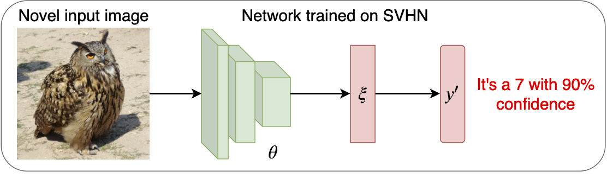
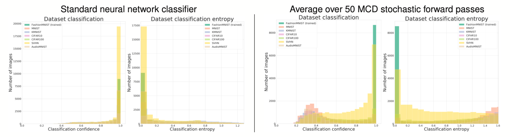
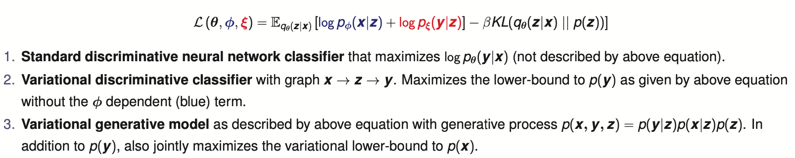
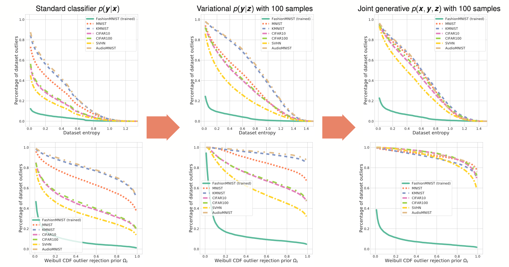

# Code for our paper: Open Set Recognition Through Deep Neural Network Uncertainty: Does Out-of-Distribution Detection Require Generative Classifiers?  

This repository contains PyTorch code for our ICCV-W 2019 [paper](http://openaccess.thecvf.com/content_ICCVW_2019/papers/SDL-CV/Mundt_Open_Set_Recognition_Through_Deep_Neural_Network_Uncertainty_Does_Out-of-Distribution_ICCVW_2019_paper.pdf):

> **Martin Mundt, Iliiua Pliushch, Sagnik Majumder and Visvanathan Ramesh:
> *"Open Set Recognition Through Deep Neural Network Uncertainty: Does Out-of-Distribution Detection Require Generative Classifiers?"*
> International Conference on Computer Vision (ICCV) 2019, First Workshop for Statistical Deep Learning in Computer Vision**

### Short summary of the challenge
For those unfamiliar with the open set recognition challenge in deep neural networks, here is a qualitative illustration to motivate the problem:

In other words, neural network based classifiers tend to produce overconfident predictions for data from tasks that they have never seen during training. In a naive approach, this thus leads to completely nonsensical predictions, that we would like to avoid and instead say "we don't know about this yet". 

Ideally, methods to estimate uncertainty of the model should help in this, however as we show in our paper do not solve this challenge entirely if used in conjunction with prediction scores. Here is a quantitative example of Softmax confidences and predictive entropies of a network trained on FashionMNIST and then tested on a diverse set of other datasets, without and with uncertainty estimation using Monte Carlo Dropout. We see that the latter improves significantly, but still has significant amounts of overlap in high confidence or low entropy regions. In our paper we investigate this further depending on model choice and metric used for out-of-distribution detection.

Our code allows to train various types of classification models and evaluate out-of-distribution detection for different metrics and variational approximations to estimate uncertainty. In the following we summarize how to practically choose the model type and execute the separate outlier detection script. 

## Software requirements

We list our main python packages that are required. In principle our code should work with many different versions. To allow for full reproducibility at later points in time, we also add a pip freeze `requirements.txt` for our machine's exact configuration at the point of writing the paper. Not all of these libraries are needed and the critical libraries that we use are:

* Python 3 (3.5.2)
* PyTorch 1.3.1 & torchvision 0.4.2 
* Cython >= 0.17 (for libmr) & libmr 0.1.9 (for open set recognition)
* scipy 1.2.1 & librosa 0.6.3 (for creation of AudioMNIST spectrograms)
	
and for visualization:

* Matplotlib 3.0.2
* Seaborn 0.8.1
* Tensorboard 2.0.1

# Training models - main.py file and command line parser

We have added a command line parser in `lib/cmdparser.py`. There is a variety of options that can be specified. The large majority is also set to a sensible default value and doesn't need to be touched to reproduce the results of our paper. All the options, together with a help dialogue can be printed with:

	python3 main.py --help

We will describe the most important options that can be used for the various experimental settings below. 

In the code we have added docstrings to each function and class, specifying what is being done, what the arguments are, what attributes a class has and what is returned. 

## Model choice and model training

Different types of models can be trained by specifying certain flags in the command line parser and executing the main.py file. There is four general types of models that can be trained with this code, three of which are evaluated in the paper. 

 

By default, a standard neural network classification approach p(y|x) is used if nothing further is specified.

Using the `train-var` flag we can turn this into a discriminative variational latent variable model with latent variables **z** and p(y|z):

	python3 main.py --train-var True

This corresponds to model type 2 in the above list, without the blue term in the equation. 

In addition, we can move to a generative approach based on a joint model as illustrated in point 3 by specifying: 

	python3 main.py --train-var True --joint True

This means an additional decoder (with the same architecture as the encoder) is added to our model and trained jointly. 

Even though we have not reported this in the paper, our code technically also allows for a fourth model which could be evaluated: `python3 main.py --joint True`. This corresponds to a simple Autoencoder (i.e. non-variatonal) with an additional classifier. 

### Dropout and variational samples during training
One of the ways to estimate uncertainty is to use dropout Monte Carlo, i.e. training a neural network with dropout at every layer and then later conducting multiple stochastic forward passes through the network. 

We can add a dropout operation at every layer of our network by specifying the dropout probability:

	python3 main.py --dropout 0.2 
	
By default this probability is 0.0 and thus no dropout is added. 
While we typically only use stochastic forward passes during inference and approximate the expectation in above equation with one sample during training, we can technically set both the samples z ~ q(z|x) from our approximate posterior as well as the Monte Carlo dropout samples to a larger amount during training:

	python3 main.py --dropout 0.2 --model-samples 50 --var-samples 100 
	
Note that we have named the Monte Carlo dropout samples "model samples" for convenience (as the weights of the entire model are sampled), even though technically both kinds of sampling methods are variational approximations. We again emphasize that these values are typically set to 1 during training (as has been done in our paper also) and only set to larger values during inference.  

### Dataset choice and architectures

We have added dataset loaders in `lib/Datasets/datasets.py` for all the datasets mentioned in the paper. We have also added an ImageNet loader for people to experiment with, even though we haven't reported ImageNet experiments in our paper. If you do experiment with ImageNet we would very much appreciate if you could share your insights. 

The dataset to train on can be specified with: 
	
	python3 main.py --dataset FashionMNIST

While our paper only reports experiments on wide residual networks (for better classification accuracy), we have also added a simple MLP architecture and a shallower CNN based on the DCGAN architecture to allow for less compute intensive experiments. The neural architectures can be specified with the `--architecture` argument or in short:

	python3 main.py -a MLP 

Further architectural parameters such as wide residual network depth and width can be found in the command line parser. 

### Logging and visualization
We log our training to a TensorBoard log file. Each experiment generates a new folder that contains the major important command line options in its name and a time stamp to quickly distinguish experiments. A full specification of command line arguments is further saved to an `stdout` file and to the TensorBoard text tab.

You can visualize the TensorBoard log by pointing to the automatically generated runs/ folder:

	tensorboard --logdir runs/

# Dataset outlier evaluation with already trained models - standalone script

We have decouple the training of the model from the outlier prediction stage for convenience and to avoid repeatedly having to train models. Once a model has been trained, we can use the stored model files to evaluate out-of-distribution detection based on the trained dataset and a list of unseen unknown datasets. 

The script is called `eval_openset.py` and uses the same command line parser. The `--resume path/to/model.pth.tar` option needs to be specified to load an already trained model. The script will print inlier percentages and outlier percentages for all specified datasets and methods in the paper.

The open set datasets can be specified in a comma separated string as shown in the following example:

	python3 eval_openset.py --resume <path/to/model> --openset-datasets 'FashionMNIST,AudioMNIST,CIFAR10,CIFAR100,SVHN'
	
Note that depending on the model you have trained, you will need to also specify the exact same command line options such as `--train-var True` or a `--dropout 0.2` probability, as well as the architecture type itself. Apart from loading the model, doing this will import a different set of functions to evaluate out-of-distribution detection. E.g. for a standard neural network we will conduct the Weibull EVT fits on the penultimate neural network layer, whereas for variational models we will use the latent space as specified in the paper. 
	
In addition and as mentioned above, you can optionally specify the number of samples to draw from the approximate posterior `--var-samples` to gauge the improvement in out-of-distribution detection with uncertainty estimates. Note that for a large number of samples, both the Weibull EVT approach (sitting directly on z) as well as the linear classication layer are very fast to compute. Apart form this you can further specify the `--model-samples 50` for stochastic forward Monte Carlo dropout passes through the entire network. Note that this is very heavy to compute and will take a very long time depending on the architecture (short for MLP but up to multiple hours for a deep residual network).

The script will also produce the outlier detection figures as shown in the paper: 

as well as a couple of other plots such as per class mean **z** values, confidence and predictive entropy histograms (as shown at the beginning of this README).

